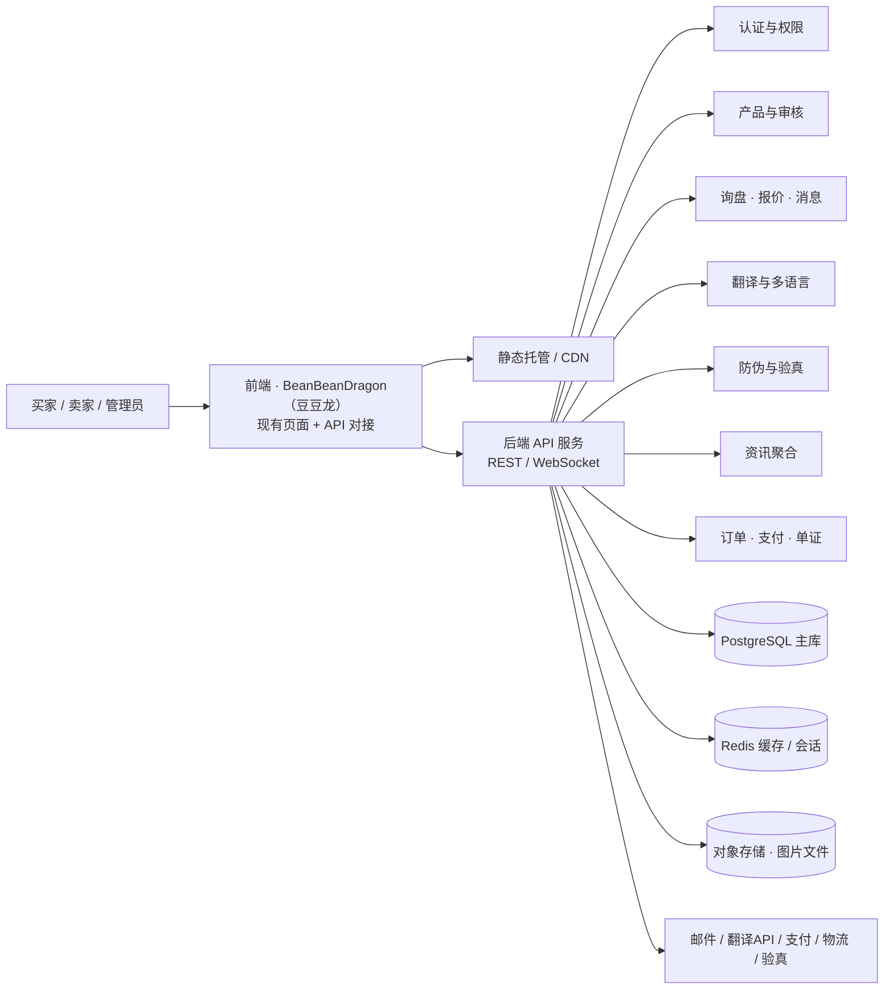

# BeanBeanDragon（豆豆龙）后端设计方案与建设路线

> 目标：把当前纯前端演示原型升级为可真实运营的 B2B 外贸平台。
> 原则：沿用现有页面与交互，仅把“浏览器本地数据”替换为“后端 API + 数据库”，
> 分阶段演进，避免一次性重写。

## 1. 总体架构

## 2. 核心模块划分

| 模块 | 职责 | 对应前端现状 |
| --- | --- | --- |
| 账号与认证 | 注册/登录、邮箱验证、JWT 会话、三种角色（买家/卖家/管理员） | 本地演示登录 |
| 企业认证 | 企业资料、营业执照/证书上传、审核、认证标识 | 管理员“企业认证” |
| 产品中心 | 产品 CRUD、多语言字段、图片上传、审核状态机（草稿→待审→通过/驳回→上下架） | 产品发布/审核 |
| 询盘与报价 | 询盘创建、消息往来、结构化报价单、状态流转、已读回执 | 站内询盘模拟 |
| 消息与通知 | 站内信、WebSocket 实时消息、邮件通知（询盘提醒/报价回复） | 无 |
| 翻译服务 | 服务端代理第三方翻译、缓存、额度管理、人工校对标记 | 前端直连翻译 |
| 防伪与验真 | 防伪码签发/作废、扫码验真、查询记录、可选区块链存证 | 前端演示验真 |
| 资讯聚合 | 官方 RSS/API 抓取、分类/地域、人工审核、来源存档 | 静态资讯数据 |
| 订单与交易 | PO/合同、电子签、支付对接、物流跟踪、履约保障 | 无 |
| 管理后台 | 内容审核、用户/企业管理、风控、审计日志、数据看板 | 本地管理后台 |

## 3. 核心数据模型（第一版表清单）

- `users` — 账号（角色、状态、邮箱验证、登录信息）
- `companies` — 企业资料（认证状态、证件文件、地址）
- `products` — 产品主表（卖家、类目、价格、MOQ、交期、贸易术语、审核状态、上下架）
- `product_translations` — 产品多语言内容（语言、标题、描述、卖点）
- `inquiries` — 询盘（买家、产品、数量、期望支付方式、状态）
- `quotes` — 报价单（单价、贸易术语、支付方式、有效期、交期、备注）
- `messages` — 买卖双方消息（会话、内容、翻译缓存、已读状态）
- `anti_fake_codes` — 防伪码（产品、签发批次、状态、查询记录）
- `news_items` / `news_sources` — 资讯与来源
- `audit_logs` — 操作留痕（谁、何时、做了什么）
- `notifications` — 站内通知
- `files` — 上传文件索引（图片/证书/单证）
- `orders`（第二阶段）— 订单、支付流水、物流

## 4. 技术选型（三档，按团队情况选择）

| 方案 | 技术栈 | 适合 | 优缺点 |
| --- | --- | --- | --- |
| A. 渐进式全栈（推荐） | Next.js（前端+API）或 NestJS + PostgreSQL + Prisma + Redis + 对象存储 | 想快速上线、团队较小 | 类型安全、生态成熟、前后端同构；需自行运维部分组件 |
| B. 托管后端 BaaS | Supabase 或 Firebase（认证+数据库+存储+实时）+ 现有前端 | 非技术团队、最快起步 | 少写基础设施代码；但深度定制受限、长期成本上升 |
| C. 企业级 | Java Spring Boot / Go + PostgreSQL + Kafka + K8s | 大团队、高并发、强合规 | 稳定可扩展；开发与运维成本高 |

推荐起点：**方案 A**（Next.js 或 NestJS + PostgreSQL），用 Docker Compose 本地起全套，
成熟后再上云（阿里云/腾讯云，或海外 AWS/GCP + Vercel）。

## 5. 建设路线图

### 阶段 0：契约先行（约 1 周）
- 完成 ER 图与数据库表结构
- 用 OpenAPI 定义全部接口（认证、产品、询盘、审核……）
- 前端抽象数据层：把 `localStorage` 读写收敛为统一的 `api.js` 模块

### 阶段 1：MVP 后端（约 4–8 周，1 名开发者）
- 账号认证、企业认证、产品发布与审核、询盘与报价、管理后台
- 邮件通知（询盘提醒、认证结果）
- 验收：现有前端全部页面切到真实数据，本地演示逻辑下线

### 阶段 2：交易与沟通增强（约 4–6 周）
- WebSocket 站内实时消息 + 翻译对接
- 订单/PO、电子合同签署、支付对接（PayPal/Stripe 或境内合规通道）
- 物流跟踪与履约保障（验货、保险）

### 阶段 3：国际化与合规（约 4 周）
- 产品多语言字段 + 服务端翻译代理（DeepL/Azure，带额度管理）
- 资讯自动聚合 + 订阅推送
- 目的国合规清单动态化、出口管制/制裁名单筛查

### 阶段 4：防伪溯源与风控（约 4 周）
- 防伪码权威签发 + 真实二维码 + 区块链存证
- 反欺诈、异常登录、内容风控自动化

## 6. 前端对接改造点（现有代码）

1. `loadState / saveState`（localStorage）→ 改为异步 API 调用与本地缓存
2. 登录/角色切换 → 真实登录 + JWT 保存
3. 产品发布/审核/上下架 → 产品 API + 审核状态机
4. 询盘/报价 → 询盘与报价 API；消息页 → WebSocket
5. 防伪码 → 服务端签发与验真 API
6. 翻译 → 服务端代理接口（前端不再直连第三方）

## 7. 安全与合规清单

- HTTPS、JWT 短期令牌 + 刷新令牌、密码加盐哈希（bcrypt/argon2）
- 密钥存环境变量/密钥管理服务，绝不出现在前端
- 图片文件校验（类型/大小）并走对象存储私有桶 + 签名 URL
- 接口限流、防爬、输入校验（Prisma/zod 双重校验）
- 审计日志（管理操作全留痕）
- 数据合规：若面向中国用户需 ICP 备案与个保法合规；面向欧盟需 GDPR；
  外贸数据跨境需明确告知用户数据用途
- 支付走持牌通道，资金与订单分离

## 8. 还需要补充的方向（后端视角）

1. 真实账号体系与邮箱验证（当前为本地模拟）
2. 图片与证书上传、CDN 分发
3. 实时消息与通知（WebSocket + 邮件）
4. 订单、支付、电子签、物流与履约保障
5. 防伪验真服务（权威签发 + 扫码 + 存证）
6. 资讯自动聚合与订阅推送
7. 多语言内容管理（产品多语言表 + 翻译校对）
8. 内容审核自动化（图片识别 + 违禁词库）与人工工作流
9. 监控告警、日志、备份与容灾
10. 合规资质：ICP/备案、外贸主体资质、数据跨境声明

## 9. 建议的第一步

先做“阶段 0”的产出：ER 图 + OpenAPI 接口定义 + 前端数据层抽象。
这三样确定后，无论选哪套技术栈，后续开发都不会返工。

## 10. 阶段 0 已交付（2026-08）

- `docs/er-diagram.md` — 数据库 ER 图（第一版 16 张表）
- `docs/openapi.yaml` — OpenAPI 3.0 接口定义（约 20 个端点）
- `api.js` — 前端数据层：页面统一通过 `window.api` 访问数据；
  当前 `mode='mock'` 用 localStorage 模拟（带延迟与错误语义），
  接入真实后端时改为 `mode='http'` 并实现各服务 http 分支
- `test/api-smoke.cjs` — 数据层冒烟测试（Playwright，16 项断言）

前端已接入数据层：`loadState / saveState` 改走 `api.storage`，
`api.*` 变更后自动触发页面重绘（`api:changed` 事件），
后续把 mock 换成真实接口时页面逻辑无需改动。

## 11. 阶段 1 已开工（2026-08 · 后端 MVP）

按“先建库、再实现接口”的顺序完成第一版可运行后端：

- `backend/db/schema.sqlite.sql` — 本地开发/测试库（SQLite，启动自动建表 + 种子）
- `backend/db/schema.postgres.sql` — 生产库 DDL（PostgreSQL）
- `backend/src/server.mjs` — HTTP 服务与全部接口（对应 openapi.yaml）
- `backend/src/db.mjs / auth.mjs / seed.mjs` — 数据访问、scrypt 密码哈希、
  HMAC 令牌、演示数据
- `backend/test/api.test.mjs` — 接口自动化测试（33 项断言，全部通过）
- 说明与启动方式：`backend/README.md`

技术说明：阶段 1 刻意保持零依赖（Node 内置 http + sqlite），先跑通业务闭环；
正式部署时替换为 PostgreSQL + 框架（NestJS/Express）并加分页、队列、WebSocket。

## 12. 阶段 1 增强（2026-08 · 占位方向全部落地）

按顺序完成六个方向的实现：

1. **翻译服务端代理**（`src/translate.mjs`）：真实服务链 MyMemory→LibreTranslate→离线词典兜底，
   结果缓存 + 按用户每日字符额度（`TRANSLATION_DAILY_QUOTA`），超限返回 429；
2. **文件上传**（`src/storage.mjs`）：multipart 与 base64 JSON 两种上传，类型/大小校验，
   本地磁盘存储 + 下载接口，存储层抽象可换 S3/OSS；
3. **WebSocket 消息**（`src/ws.mjs`）：RFC6455 握手与帧编解码（零依赖），
   `/ws?token=` 鉴权，会话内广播 + 落库；
4. **邮件与站内通知**（`src/mailer.mjs`）：询盘→通知卖家、报价→通知买家，
   邮件走 mail_outbox 落库（transport 可切 SMTP）；
5. **接口分页**：产品/资讯/日志支持 `page/size`，返回 `{items,total,page,size}`，
   前端 api.js HTTP 模式自动解包保持一致；
6. **生产部署**：Dockerfile + docker-compose（数据/上传卷挂载）、.env.example、
   `docs/deployment-guide.md`（HTTPS、PostgreSQL 迁移、备份与上线前外部服务清单）。

安全自查补充：登录限流（同 IP 每分钟 10 次）、上传类型/大小白名单、服务端生成文件键防路径穿越、
令牌过期校验；测试共 160 项通过（后端接口 37 + WebSocket 5 + 前端数据层 16 + 页面回归 102）。

## 13. 真实翻译密钥与 SMTP 通道（2026-08）

- **DeepL 主通道**（`src/translate.mjs`）：`DEEPL_API_KEY` + `DEEPL_API_URL` 配置，
  `TRANSLATION_PROVIDER=deepl` 仅用 DeepL（缺密钥返回 503 CONFIG_MISSING）；
  `chain` 模式优先 DeepL，随后 MyMemory→LibreTranslate→离线兜底；
- **SMTP 真实发送**（`src/smtp.mjs`，零依赖）：EHLO/STARTTLS/AUTH PLAIN/MAIL/RCPT/DATA/QUIT
  完整流程，结果落库 `mail_outbox`（sent/failed+原因），失败不影响业务主流程；
- **配置加载**（`src/env.mjs`）：自动读取 `backend/.env`，不覆盖已存在的环境变量；
- **协议级验证**：本地假 DeepL 端点校验鉴权头与表单；本地假 SMTP 服务器校验指令流与落库；
  后端测试增至 53 项（接口 41 + SMTP 7 + WS 5），全部通过。

真实调用只需在 `backend/.env` 填入密钥/凭据并联网即可，无需改代码。
