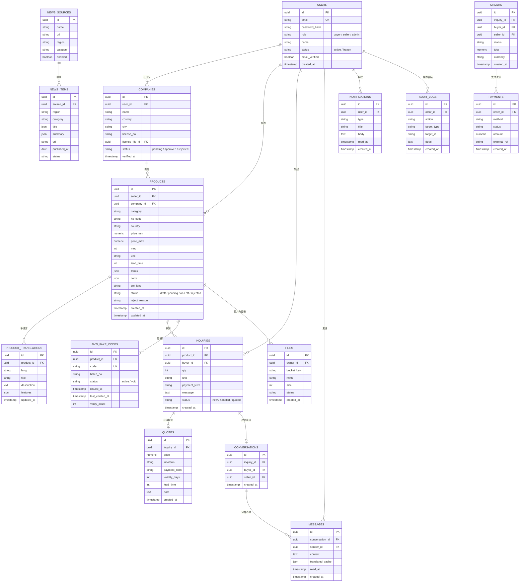

# BeanBeanDragon（豆豆龙）数据库 ER 图（阶段 0 · 第一版）

> 说明：以下为第一版核心表设计。`orders` / `payments` 属第二阶段（交易闭环），
> 先列出以预留扩展。字段仅保留关键项，实际建表时再补充索引与约束。

## 关键约束

- `USERS.email`、`PRODUCT_TRANSLATIONS(product_id, lang)`、`ANTI_FAKE_CODES.code` 唯一；
- 产品文本放 `PRODUCT_TRANSLATIONS`（源语言 + 平台整理的中英文 + 机器翻译缓存），
  产品主表只保留结构化字段（价格、MOQ、HS 编码等）；
- 审核状态机：`draft → pending → on / rejected`，管理员操作写入 `AUDIT_LOGS`；
- 防伪码由服务端签发（唯一、可作废、记录查询次数与时间）。
