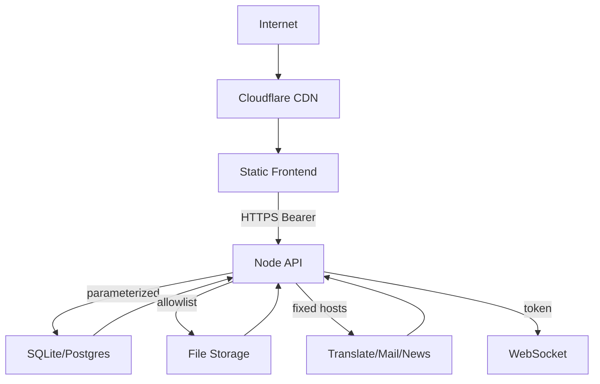

# BeanBeanMouse 威胁模型（trade-boat-threat-model）

> 依据 `security-threat-model` skill 规范生成，2026-08-16。面向后端 API 上线前评估。

## Executive summary

豆豆鼠是面向全球买家的外贸 B2B 平台：前端为 Cloudflare Pages 静态站（本地演示模式 + 可切换 HTTP API），后端为 Node 原生 HTTP + SQLite/PostgreSQL API。当前后端尚未公网部署，威胁集中在“上线后”的鉴权绕过、凭证泄露、上传滥用、滥用（刷单/打赏/注册）与信息泄露。最高风险路径是 JWT 密钥配置缺失导致令牌伪造（已修复）与管理员接口的越权面；其余为多租户数据隔离、限流、日志与依赖管理。

## Scope and assumptions

**In-scope**：`backend/src/*`（server/auth/db/mailer/translate/storage/ws/seed）、`api.js`、`app.js`、`data.js`、`_headers`、部署配置（wrangler.jsonc、docker-compose.yml）。

**Out-of-scope**：支付/托管（尚未接入）、前端第三方翻译服务本身、GitHub/Cloudflare 平台侧安全。

**Assumptions（影响排序，用户未逐一确认，按合理默认）**：
- 部署模型：前端 Cloudflare Pages；后端计划部署到 Node 主机或 Cloudflare Workers/D1（当前未上线）。
- 暴露面：公网可达；多租户（买/卖/管理员）。
- 数据敏感度：含用户邮箱、公司资质、订单金额、聊天与存证哈希；无支付凭据。
- 认证：Bearer JWT（1 小时有效）；无 Cookie，故无经典 CSRF。
- 规模：早期小规模，注册/登录限流为单进程 Map（多实例需边缘限流）。

**Open questions（不阻塞本次评估）**：
1. 后端最终部署到 VPS/Docker 还是 Cloudflare D1/Functions？（影响限流与存储模型）
2. 是否接入真实邮件/SMTP？（影响验证码与钓鱼面）
3. 支付/托管交易何时接入？（届时需新增威胁面评审）

## System model

### Primary components
- 静态前端（`index.html`/`app.js`/`api.js`/`data.js`）：本地 localStorage 演示模式或直连后端。
- API 服务（`backend/src/server.mjs`）：原生 HTTP 路由，SQLite（`db.mjs` 参数化）。
- 认证（`auth.mjs`）：scrypt + JWT。
- 文件存储（`storage.mjs`）：本地磁盘 + MIME/魔数白名单。
- 翻译/邮件/新闻（`translate.mjs`/`mailer.mjs`）：固定主机出站。
- WebSocket（`ws.mjs`）：极简聊天广播。

### Data flows and trust boundaries
- Internet → 前端（HTTPS，Cloudflare CDN）：静态资源 + CSP/安全头。
- Internet → API Server（HTTPS，Bearer JWT）：注册/登录/产品/询盘/报价/订单/打赏/存证/物流/管理接口；输入校验 + 限流 + 参数化 SQL。
- 前端 → localStorage：仅演示数据，无令牌。
- API → 外部服务（翻译/邮件/新闻 RSS）：固定主机，超时 + 失败降级。
- API → 文件存储：白名单 MIME + 魔数 + 服务端生成文件名。

#### Diagram

## Assets and security objectives

| Asset | Why it matters | Objective |
|-------|----------------|-----------|
| 用户凭证/邮箱 | 注册/登录/验证 | C/I |
| 公司资质与审核状态 | 卖家准入 | C/I |
| 订单/打赏/存证链 | 交易与纠纷证据 | I/C/A |
| JWT_SECRET | 全部鉴权根基 | C/I |
| 管理员接口 | 审核/用户管理/资讯 | I/C/A |
| 上传文件 | 可能承载恶意内容 | I/A |
| 审计日志 | 溯源与合规 | I/A |

## Attacker model

### Capabilities
- 匿名公网访问者：注册、浏览、发询盘、上传文件、枚举接口。
- 已注册用户：创建订单/打赏/物流、查看自己数据。
- 具备自动化能力：批量注册、刷询盘、暴力猜解、WebSocket 灌消息。

### Non-capabilities
- 无支付/托管数据（未上线）；无内网横向目标（单实例）；无法利用经典 CSRF（无 Cookie 鉴权）。

## Entry points and attack surfaces

| Surface | How reached | Trust boundary | Notes | Evidence |
|---------|-------------|----------------|-------|----------|
| /auth/register /login | 公网 | Internet→API | 限流+蜜罐+邮箱验证 | server.mjs:260,311 |
| /products POST/PUT | 登录卖家 | 用户→API | 需企业已认证；数值校验 | server.mjs:465 |
| /inquiries /orders /tips | 登录用户 | 用户→API | 属主校验 | server.mjs:597-711 |
| /files POST/GET | 登录用户上传/公网下载 | 用户→存储 | MIME+魔数+服务端文件名 | storage.mjs |
| /evidence | 订单双方/管理员 | 用户→API | 哈希链只读校验 | server.mjs |
| /admin/* | 管理员 | 管理→API | role 校验 | server.mjs |
| /ws | 登录用户 | 用户→WS | 令牌握手+缓冲上限 | ws.mjs:57-80 |
| 前端 DOM | 浏览器 | 页面→DOM | esc()+CSP | app.js |

## Top abuse paths

1. **令牌伪造**：未配置 JWT_SECRET → 伪造 admin 令牌 → 接管后台（已修复：生产强制配置）。
2. **管理员接口越权**：枚举 /admin/* → 若 role 校验遗漏某路由 → 改产品/冻结用户。
3. **多租户越权**：猜测他人 order/inquiry id（UUID 随机，难枚举）→ 读取/操作他人数据；依赖属主校验完整性。
4. **上传滥用**：上传超限/伪装文件 → 存储耗尽或同源恶意内容（已加魔数校验；仍需配额）。
5. **注册/打赏滥用**：批量注册、刷打赏/品类需求 → 污染数据与通知（进程内限流，边缘需叠加）。
6. **WebSocket 灌消息**：无频率限制 → 骚扰对方、数据库膨胀（建议加消息频率限制）。
7. **XSS（前端）**：若某渲染路径漏掉 esc() → 窃取页面状态（CSP 已兜底）。
8. **凭证泄露**：邮箱验证链接 token 落日志 → 账户接管（Referrer-Policy 已缓解；建议改登录后输入验证码）。

## Threat model table

| Threat ID | Threat source | Prerequisites | Threat action | Impact | Assets | Existing controls | Gaps | Recommended mitigations | Detection | L | I | Priority |
|-----------|---------------|---------------|---------------|--------|--------|-------------------|------|-------------------------|-----------|----|----|----------|
| TM-001 | 远程匿名 | 生产未配置 JWT_SECRET | 伪造任意用户令牌 | 全站接管 | JWT_SECRET | 无（已修复） | 历史兜底密钥 | 生产强制配置+启动校验 | 启动日志 | high | high | critical |
| TM-002 | 登录用户 | 猜测/获取 admin 路径 | 访问管理接口 | 数据篡改 | 管理面 | role 校验 | 审计覆盖需核对 | 每路由显式 role 校验 + 测试 | 审计日志 | med | high | high |
| TM-003 | 登录用户 | 其他订单 id | 读取/操作他人订单/存证 | 隐私泄露 | 订单数据 | 属主校验 | 无 | 保持属主校验 + 定期测试 | 审计日志 | low | high | medium |
| TM-004 | 匿名/注册 | 上传接口 | 上传恶意/超大文件 | 存储滥用 | 文件 | MIME+魔数+大小 | 无配额/毒化扫描 | 加每用户配额 + 病毒扫描（可选） | 日志 | med | low | medium |
| TM-005 | 自动化 | 注册/打赏接口 | 批量刷单/刷打赏 | 数据污染 | 用户/订单 | 进程内限流+蜜罐 | 多实例失效 | 边缘限流 + 行为风控 | 指标 | med | med | medium |
| TM-006 | 登录用户 | WS 连接 | 高频消息灌爆 | 骚扰/存储膨胀 | 聊天 | 缓冲上限 | 无频率限制 | WS 消息频率限制 | 监控 | med | low | low |
| TM-007 | 远程匿名 | DOM XSS 路径 | 注入脚本 | 状态窃取 | 前端 | esc()+CSP | 未引入 Sanitizer | 上线前 XSS 测试 | 前端错误监控 | low | high | medium |
| TM-008 | 网络窃听者 | 邮件链路 | 截获验证链接 | 账户接管 | 验证 token | Referrer-Policy | URL 传递 | 登录后输入验证码 | 登录审计 | low | high | low |

## Criticality calibration

- **critical**：可导致全站鉴权绕过（TM-001）。
- **high**：管理员面越权、他人数据读取（TM-002/003）。
- **medium**：滥用/数据污染/前端 XSS（TM-004/005/007）。
- **low**：骚扰/低影响泄露（TM-006/008）。

## Focus paths for security review

| Path | Why it matters | Related Threat IDs |
|------|----------------|--------------------|
| `backend/src/server.mjs`（route 全量） | 全部入口与属主/role 校验集中点 | TM-002, TM-003 |
| `backend/src/auth.mjs` | 令牌签发/校验根基 | TM-001 |
| `backend/src/storage.mjs` | 上传白名单与存储 | TM-004 |
| `backend/src/ws.mjs` | 聊天滥用面 | TM-006 |
| `app.js`（innerHTML 渲染） | 前端 XSS 面 | TM-007 |
| `_headers` | CSP 等浏览器防护 | TM-007 |

## Quality check

- ✅ 入口点：auth/products/inquiries/orders/tips/files/evidence/admin/ws/news/translate 均已覆盖。
- ✅ 信任边界：Internet→前端、Internet→API、用户→存储、用户→WS、API→外部服务均有威胁覆盖。
- ✅ 运行时与 CI/开发分离：本次仅评运行时；CI 无第三方脚本风险。
- ✅ 假设与开放问题已显式列出。
- ✅ 输出格式符合 prompt-template。
